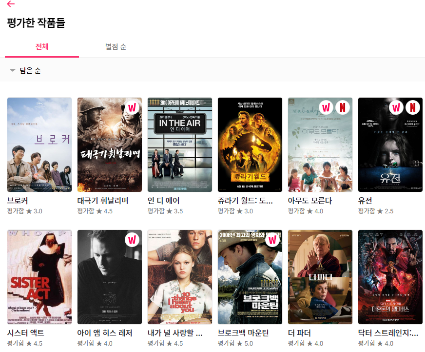

# WatchaBomb_Django

## 주제
소비자 행동 패턴 분석 기반의 영화 추천 시스템 구현

## 왓챠피디아 크롤링
- 왓챠피디아 유저별 평가한 작품들을 크롤링하여 영화 추천을 위한 데이터로 활용

  

## ML/DL Model
## Model (영화 추천 시스템)에서 많이 사용하는 ML/DL 기법.

---

- **콘텐츠 기반 필터링 (Content-based Filtering)**
    - 사용자가 특정 콘텐츠(아이템)를 선호? → 그 아이템과 비슷한 콘텐츠(아이템)를 추천
    - 유저가 확인한 콘텐츠 자체 정보를 분석하여 유저의 데이터와 유사한 콘텐츠를 비교하여 추천
- **협업 필터링 (Collaborative Filtering) → Based on User Behavior**
    - **아이템 기반 협업 필터링 (Item based collaborative filtering)**
        - KNN(K nearest neighbor) 사용한 기법. (+cosine similarity / pearson correlation)
        - 사용자가 아직 평가하지 않은 아이템을 예측.
            - **사용자 기반 :** 비슷한 유저가 특정 아이템을 선택했다! 를 알려줌.
            - **아이템 기반 :** 특정 아이템을 선택한 유저가 이런 아이템도 선택했더라? 를 알려줌.
    - **잠재 요인 기반 협업 필터링(latent factor based collaborative filtering)**
        - SVD(Singular Vector Decomposition) → Matrix Factorization 기법.
        - 사용자와 아이템 데이터에 숨어 있는 특징을 잠재적인 차원(factor)을 사용해 나타내고자 하는 모델.

## 웹 구현(Django)